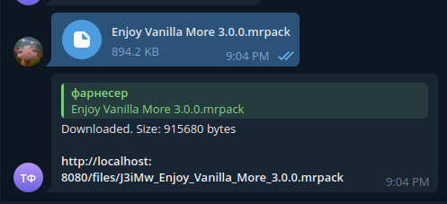
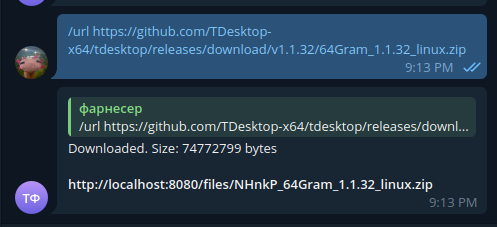
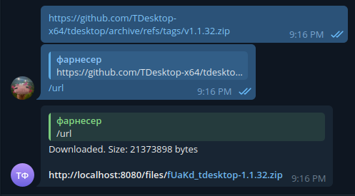

# 🌟 **FilesLink** – Your Reliable File Sharing and Storage Assistant! 🌟

**FilesLink** – is a simple and convenient bot that allows you to quickly and securely upload files and receive download links. Now with **Telegram-as-Storage** support - use Telegram's cloud infrastructure instead of local disk storage!

## 📋 **Features:**

- **File Upload:** Send your files to the bot, and it will store them on Telegram's servers
- **Get a Download Link:** After the upload, you will receive a unique link to download the file
- **Telegram as Cloud Storage:** No local disk usage - all files stored on Telegram (up to 2GB per file)
- **Easy to Use:** Simple interface for uploading and receiving files
- **URL Download:** Download files from external URLs directly to Telegram storage

## 🚀 **How It Works:**

1. **Send a File to the Bot:** Upload any file you wish to save or share
2. **Bot Stores in Telegram:** Your file is forwarded to a private storage channel on Telegram
3. **Receive the Download Link:** Get a direct download link that streams from Telegram
4. **Click to Download:** Anyone with the link can download the file through your server

## ☁️ **Telegram Storage Mode:**

This bot now uses **Telegram as your cloud storage backend**:
- ✅ Files stored on Telegram's servers (not your disk)
- ✅ Up to 2GB per file
- ✅ Automatic backups through Telegram
- ✅ No disk space management needed
- ✅ Access files from anywhere

📖 **[Read the Telegram Storage Setup Guide](TELEGRAM_STORAGE_SETUP.md)** for detailed configuration instructions.

## 📂 **Use Cases:**

- **File Sharing:** Quickly share documents, images, or videos with friends and colleagues.
- **Data Transfer to Server:** Upload files for backup or further processing.
- **Download files from http** - You can download files to the server by sending a link to the bot.

### 📥 **Send a File to the Bot:**

1. **Send a File:**

   Send a file to the bot by attaching it to a message. The bot will save the file on the server.

2. **Receive the Download Link:**

   After the file is uploaded, the bot will provide you with a unique link to download the file.



### 📤 **Download Files from HTTP:**

1. **Send a Link:**

   Use /url command to send a link to the bot. The bot will download the file to the server.

   Example:
    ```text
    /url https://example.com/file.zip
    ```
   

   Or reply for the message with the link.

   

2. **Receive the Download Link:**

   After the file is downloaded, the bot will provide you with a unique link to download the file.

## 🧩 **Installation and Setup**

### 📝 **Set Up Environment Variables**

Create a `.env` file in the root directory based on the `.env.example` file and add the following variables:

   ```text
   # application
   BOT_TOKEN=123456789:abcdefghijklmnop
   SERVER_PORT=8081
   APP_FILE_DOMAIN=http://localhost:8081/files
   TELEGRAM_API_URL=http://nginx:80
   RUST_LOG=info
   ENABLE_FILES_ROUTE=false
   STORAGE_CHANNEL_ID=-1001234567890
   
   # telegram bot api server
   TELEGRAM_API_ID=1234567
   TELEGRAM_API_HASH=abcdefghijklmnopqrstuvwxyz0123456789
   TELEGRAM_LOCAL=true
   ```

Here's a breakdown of each environment variable:

- **`BOT_TOKEN`**: Your Telegram bot token, which you can obtain
  from [BotFather](https://core.telegram.org/bots#botfather).

  Example:
  ```text
  BOT_TOKEN=123456789:abcdefghijklmnop
  ```

- **`STORAGE_CHANNEL_ID`**: ⚠️ **REQUIRED** - The ID of your private Telegram channel where files will be stored.
  
  **Setup Instructions:**
  1. Create a private Telegram channel
  2. Add your bot as an administrator
  3. Get the channel ID (see [Setup Guide](TELEGRAM_STORAGE_SETUP.md))
  
  Example:
  ```text
  STORAGE_CHANNEL_ID=-1001234567890
  ```

  Example:
  ```text
  BOT_TOKEN=123456789:abcdefghijklmnop
  ```

- **`SERVER_PORT`**: The port on which the application will run.

  Default:
  ```text
  SERVER_PORT=8080
  ```

- **`APP_FILE_DOMAIN`**: The domain or IP address where your application is accessible with files endpoint.

  Default:
  ```text
  APP_FILE_DOMAIN=http://localhost:8080/files
  ```

  Example:
  ```text
  APP_FILE_DOMAIN=https://domain.com/files
  ```

  **Note:** This variable is used to generate a link to the file.

- **`TELEGRAM_API_URL`**: The URL of the Telegram API server. If you are running the API server in Docker, it’s
  usually the name of the Docker service.

  Default:
  ```text
  TELEGRAM_API_URL=https://api.telegram.org
  ```

- **`RUST_LOG`**: Log level for the Rust application.

  Default:
  ```text
  RUST_LOG=info
  ```

- **`ENABLE_FILES_ROUTE`**: Enable /files folder to get list.

  Default:
  ```text
  ENABLE_FILES_ROUTE=false
  ```

- **`TELEGRAM_API_ID`**: Your Telegram API ID, which you can obtain
  from [my.telegram.org](https://my.telegram.org/).

  Example:
  ```text
  TELEGRAM_API_ID=1234567
  ```

- **`TELEGRAM_API_HASH`**: Your Telegram API hash, which you can obtain
  from [my.telegram.org](https://my.telegram.org/).

  Example:
  ```text
  TELEGRAM_API_HASH=abcdefghijklmnopqrstuvwxyz0123456789
  ```

- **`TELEGRAM_LOCAL`**: Set to `true` to indicate that the bot is running on a local environment.

  Default:
  ```text
  TELEGRAM_LOCAL=true
  ```

- **`FILESLINK_PIPE_PATH`**: Path to the FIFO.

  Default:
  ```text
  FILESLINK_PIPE_PATH=/tmp/fileslink.pipe
  ```

  **Note:** CLI DO NOT use `.env` file. You need to pass the path to the FIFO as an argument or set the `FILESLINK_PIPE_PATH`.

### 🐳 **Run Using Docker Engine**

**Files uploaded via the bot are stored in the `/app/files` directory within the Docker container.** The `volumes`
section
in the `docker-compose.yml` file maps this directory to `/path/to/store/files` on your host machine. This means you can
access the files through `/path/to/store/files` on your host machine. Also, permissions file location is
a `/app/config/permissions.json`.

You can easily run **FilesLink** using Docker. Follow these steps to get started:

1. **Clone the Repository**

   Clone the repository from GitHub to your local machine:

   ```bash
   git clone https://github.com/kvnxo/fileslink.git
   cd fileslink
   ```

2. **Run the Docker Container**

   Run the Docker container with the environment variables:

   ```bash
   docker compose up -d
   ```

3. **Access the Application**

   **FilesLink** will be accessible at `http://localhost:8080`.

---

**FilesLink** – The perfect solution for easy and efficient file management!

🌟 Try it out now and see how easy file handling can be! 🌟

### 🚀 **Run Locally**

For running locally or testing, you can run **FilesLink** without Docker Compose. Here's how you can do it:

1. **Install Rust**

   Ensure you have [Rust](https://www.rust-lang.org/) installed on your machine. You can install it from
   the [official website](https://www.rust-lang.org/tools/install).

2. **Run Telegram Bot API**

   Before running the bot, you need to run the Telegram Bot API server. You can run it locally or use the official API.
   For launch the API server locally, you need to configure `.env` file and run the following command:

    ```bash
    docker compose -f dockerc-compose-telegram-api.yml up -d
    ```

   **Note:** The API server will be accessible at `http://localhost:8088`.

   **Note:** If you want to use the official API, you don't need to run the API server locally and don't need to
   set `TELEGRAM_API_URL` environment variable.

3. **Build and Run the Application**

   Build and run the application using `cargo` commands:

   ```bash
   cargo build
   cargo run
   ```

    - By default, the bot will listen on `http://localhost:8080`.

4. **Access the Application**

    - **FilesLink** will be accessible at `http://localhost:8080` for local development.

**Note:** For local testing, the `./files` directory will be relative to project’s root directory.

**Note:** Permissions file location is a `./config/permissions.json`.

### 🔧 **CLI**

Cli is used to manage permissions. You can use the following commands:

- **`update-permissions`**: Update permissions from the configuration file.

Usage:

```bash
3. **Use CLI Options:**

   ```bash
   ./fileslink-cli [OPTIONS] <SUBCOMMAND>
   ```
```

Docker usage:

```bash
docker exec -it fileslink-app fileslink-cli [OPTIONS] <SUBCOMMAND>
```

Options:

* **`--path`** - Path to the FIFO.

  default: `/tmp/fileslink.pipe`

  env: FILESLINK_PIPE_PATH

  **Note:** The path should be the same as in the bot configuration.

Subcommands:

* **`update-permissions`** - Updates the permissions from the config file.
* **`shutdown`** - Shutting down the system.
* **`help`** - Prints this message or the help of the given subcommand(s).

Update permissions:

```bash
Example:

```bash
./fileslink-cli --path /path/to/fifo.pipe update-permissions
```
```

Docker update permissions:

```bash
docker exec -it fileslink-app fileslink-cli update-permissions
```

**Note:** Docker container default path is `/app/fileslink.pipe`.

### 🛡️ **Permissions**

Permissions in the application are managed through a JSON configuration file that sets access rules for all users or
specific users regarding different chats.

Permissions updates every restart or by using the CLI command `update-permissions`

#### 🔧 **Configuration File Format**

The configuration file located at `config/permissions.json` and use the following format:

```json
{
  "allow_all": [
    "STRING_OR_LIST"
  ],
  "chats": {
    "CHAT1_ID": [
      "STRING_OR_LIST"
    ],
    "CHAT2_ID": "USER1_ID, USER2_ID",
    "CHAT3_ID": 1234567,
    "CHAT4_ID": "*"
  }
}
```

#### ⚙️ **Configuration File Fields**

##### Possible values for the chat configuration are:

- **`STRING`**: A list of IDs separated by commas - **","** (spaces are allowed) or **"*"** for all users.

  examples:
  ```json
  {
    "field1": "1234567, 2345678",
    "field2": "*"
  }
  ```

- **`NUMBER`**: A single user ID.

  example
  ```json
  {
    "field1": 1234567
  }
  ```

- **`LIST`**: A list of user IDs that have access to the chat. Allowed combination of strings and numbers.

  example

  ```json
  {
    "field1": [1234567, 2345678],
    "field2": ["1234567", "2345678"],
    "field3": [1234567, "2345678"]
  }
  ```

##### Configuration Fields:

- **`allow_all`**: Defines access rules for all users.
- **`chats`**: A dictionary where the key is the chat ID and the value is the chat configuration.

  example
  ```json
  {
    "allow_all": "*",
    "chats": {
      "chat1": "*",
      "chat2": [1234567, 2345678]
    }
  }
  ```

#### 🔑 **Configuration Examples**

##### 1. **Grant Access to All Users for All Chats**

```json
{
  "allow_all": "*",
  "chats": {}
}
```

In this example, **all users** have access to all chats because `allow_all` is set to `"*"`.

##### 2. **Grant Access to Only Specific Users for All Chats**

```json 
{
  "allow_all": [
    "1234567",
    "2345678"
  ],
  "chats": {}
}
```

This example grants access to **all chats** only to `1234567` and `2345678`.

##### 3. **Grant Access to All Users for General Chats and Set Special Permissions for Specific Chats**

```json
{
  "allow_all": 4567890,
  "chats": {
    "chat1": [
      "1234567",
      2345678
    ],
    "chat2": "*"
  }
}
```

In this example:

- **User `4567890`** have access to all chats due to `allow_all` being `"4567890"` for general access.
- **For `chat1`**, access is granted only to `1234567` and `2345678`.
- **For `chat2`**, access is granted to all users (just like the other chats).

##### 4. **Restrict Access for All Users and Set Special Permissions**

```json
{
  "allow_all": "31235425",
  "chats": {
    "chat3": [
      "43243243"
    ]
  }
}
```

In this example:

- **Only `31235425`** has access to all chats.
- **Only `43243243`** has access to `chat3`.
