# 🏗️ FilesLink Architecture Documentation

## 📋 Table of Contents
- [System Overview](#system-overview)
- [Architecture Diagrams](#architecture-diagrams)
- [Component Details](#component-details)
- [Data Flow](#data-flow)
- [Storage Model](#storage-model)
- [Security Architecture](#security-architecture)
- [Technology Stack](#technology-stack)
- [Performance Characteristics](#performance-characteristics)

---

## System Overview

FilesLink is a cloud-native file sharing system that leverages Telegram's infrastructure as a storage backend. The architecture follows a microservices-inspired design with clear separation of concerns between the bot interface, HTTP server, and storage management layers.

### Key Architectural Principles
- **Cloud-First**: Telegram as primary storage eliminates local disk dependencies
- **Stream-Based**: Memory-efficient file handling through streaming
- **Queue-Driven**: Asynchronous processing prevents system overload
- **Stateless Server**: HTTP layer remains stateless for horizontal scalability
- **Event-Driven**: Message-based communication between components

---

## Architecture Diagrams

### High-Level System Architecture

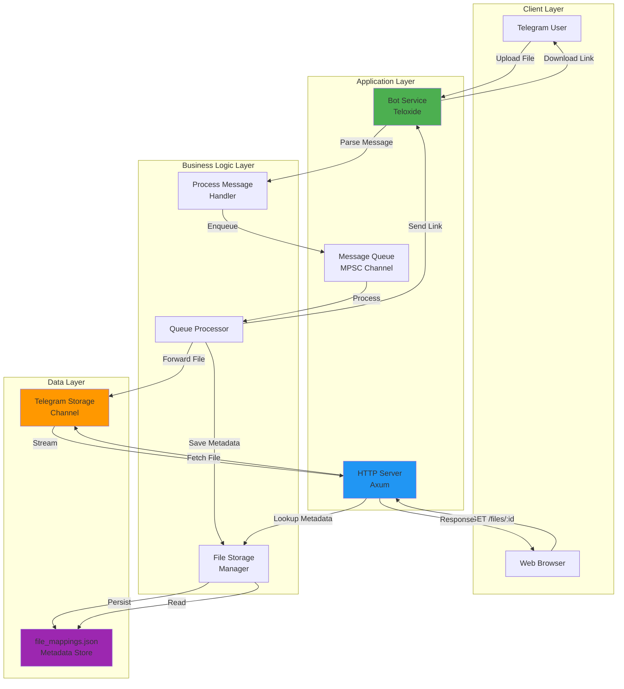

### Component Architecture

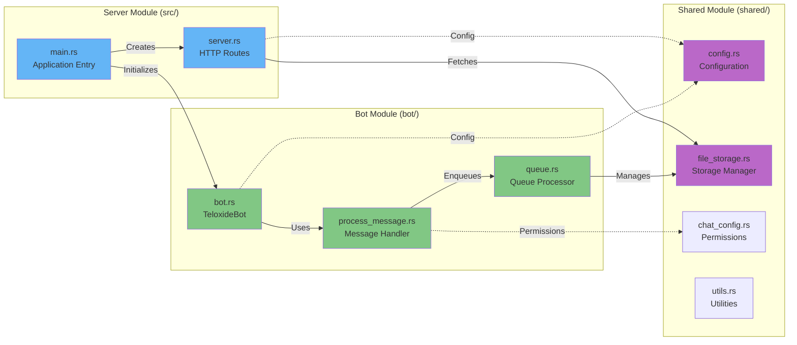

### Upload Flow Sequence

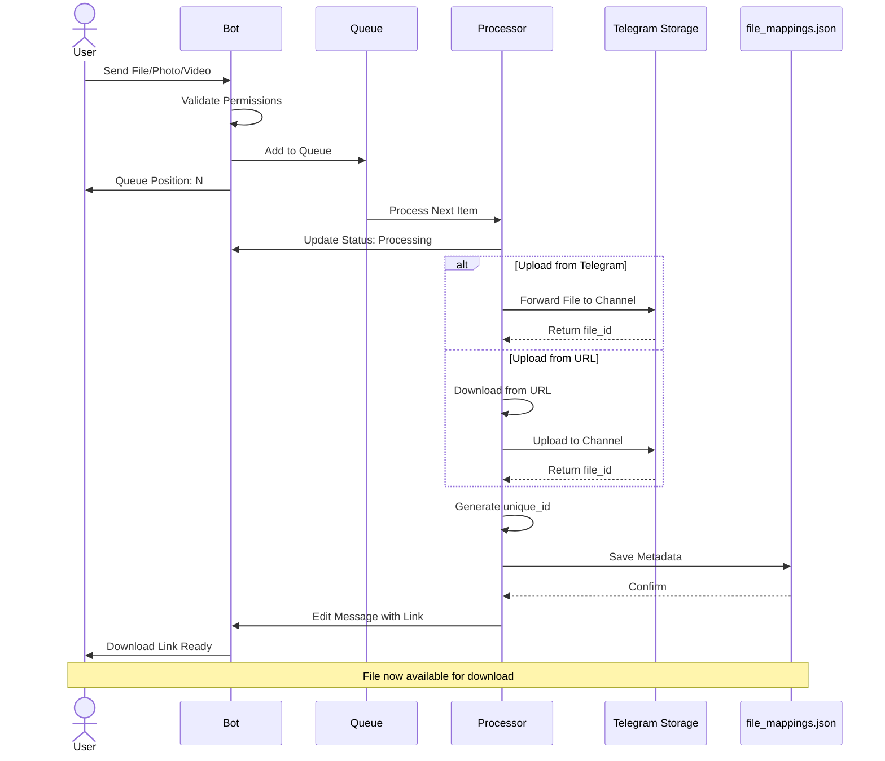

### Download Flow Sequence

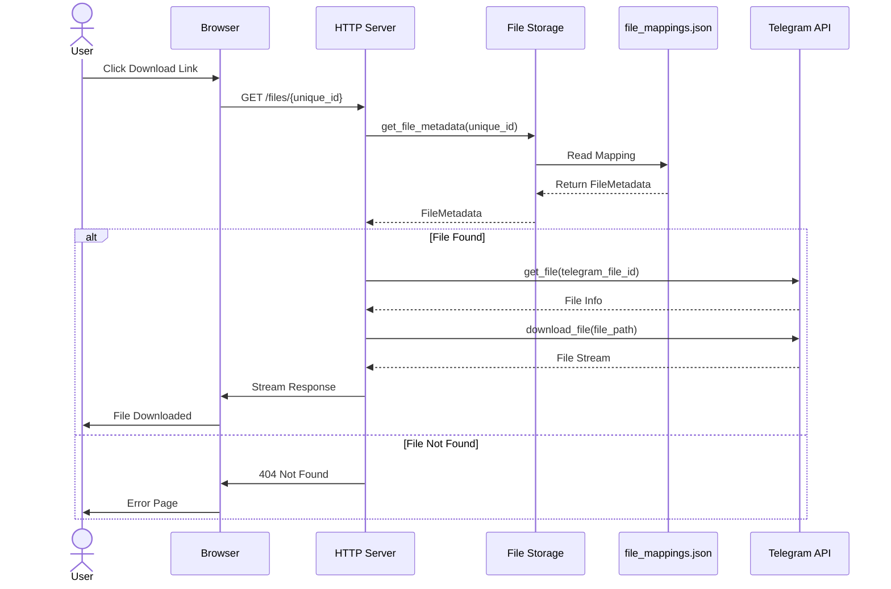

### Data Model

```mermaid
erDiagram
    FILE_METADATA {
        string unique_id PK
        string telegram_file_id
        string file_name
        string mime_type
        int file_size
        int uploaded_at
    end
    
    TELEGRAM_STORAGE {
        string file_id PK
        binary file_data
        string caption
    end
    
    QUEUE_ITEM {
        Message message
        Message queue_message
        string file_id
        string file_name
        string url
    }
    
    FILE_METADATA ||--|| TELEGRAM_STORAGE : "maps to"
    QUEUE_ITEM }|--|| FILE_METADATA : "creates"
```

---

## Component Details

### 1. Bot Service (`bot/`)

**Responsibilities:**
- Telegram message reception and parsing
- User permission validation
- File type identification (document, photo, video, animation)
- URL command processing (`/url`)
- Queue management and coordination

**Key Files:**
- `bot.rs` - Main bot implementation using Teloxide
- `process_message.rs` - Message parsing and routing logic
- `queue.rs` - Asynchronous queue processing and file forwarding

**Technologies:**
- Teloxide (Telegram Bot API wrapper)
- Tokio MPSC channels for queue communication
- Async/await for concurrent message handling

### 2. HTTP Server (`src/server.rs`)

**Responsibilities:**
- REST API endpoint serving
- File metadata lookup
- Telegram file fetching and streaming
- Content-Type negotiation
- Download header management

**Endpoints:**
| Endpoint | Method | Description | Response |
|----------|--------|-------------|----------|
| `/` | GET | Health check / Homepage | HTML |
| `/files/:id` | GET | Download file by unique_id | Binary stream |
| `/files` | GET | List all files (optional) | HTML |

**Technologies:**
- Axum web framework
- Tower middleware
- Tokio async runtime

### 3. File Storage Manager (`shared/src/file_storage.rs`)

**Responsibilities:**
- Metadata persistence and retrieval
- Thread-safe concurrent access (RwLock)
- CRUD operations for file mappings
- JSON serialization/deserialization

**Data Structure:**
```rust
pub struct FileMetadata {
    pub unique_id: String,           // 8-char nanoid
    pub telegram_file_id: String,    // Telegram's internal ID
    pub file_name: String,           // Original filename
    pub mime_type: Option<String>,   // Content-Type
    pub file_size: u32,              // Size in bytes
    pub uploaded_at: u64,            // Unix timestamp
}
```

**Storage Format:**
```json
{
  "files": {
    "a7k3m9x2": {
      "unique_id": "a7k3m9x2",
      "telegram_file_id": "BQACAgIAAxkBAAI...",
      "file_name": "document.pdf",
      "mime_type": "application/pdf",
      "file_size": 1234567,
      "uploaded_at": 1697472000
    }
  }
}
```

### 4. Configuration Management (`shared/src/config.rs`)

**Environment Variables:**

| Variable | Required | Default | Description |
|----------|----------|---------|-------------|
| `BOT_TOKEN` | ✅ | - | Telegram bot token from BotFather |
| `STORAGE_CHANNEL_ID` | ✅ | - | Private channel ID for file storage |
| `SERVER_PORT` | ❌ | 8080 | HTTP server port |
| `APP_FILE_DOMAIN` | ❌ | `http://localhost:{PORT}/files` | Base URL for download links |
| `TELEGRAM_API_URL` | ❌ | `https://api.telegram.org` | Telegram API endpoint |
| `ENABLE_FILES_ROUTE` | ❌ | false | Enable file listing endpoint |

---

## Data Flow

### Upload Pipeline

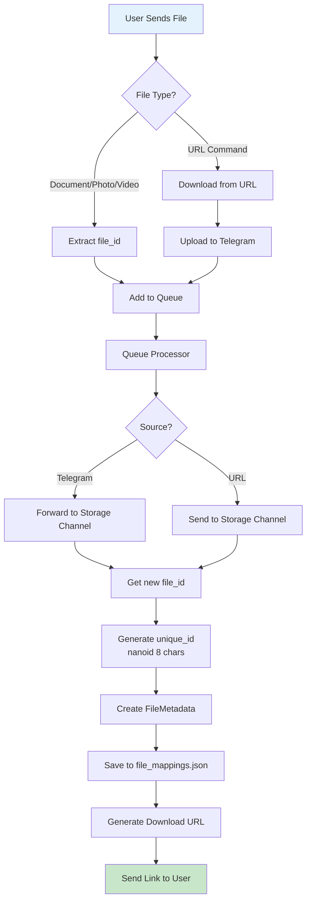

### Download Pipeline

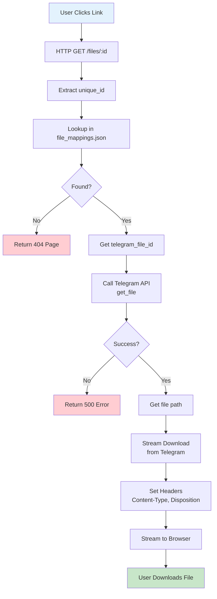

---

## Storage Model

### Architecture Pattern: Hybrid Storage

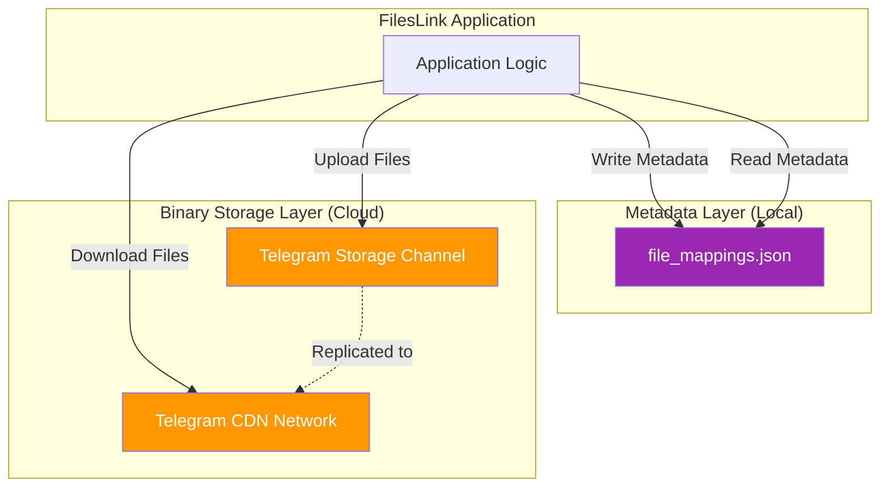

### Storage Characteristics

| Aspect | Local (Metadata) | Cloud (Binary Files) |
|--------|------------------|----------------------|
| **Type** | JSON file | Telegram channel |
| **Size** | ~1KB per 100 files | Up to 2GB per file |
| **Speed** | Instant | Network-dependent |
| **Backup** | Manual required | Auto by Telegram |
| **Redundancy** | Single point | Telegram's multi-DC |
| **Cost** | Disk space | Free (Telegram) |

---

## Security Architecture

### Security Layers

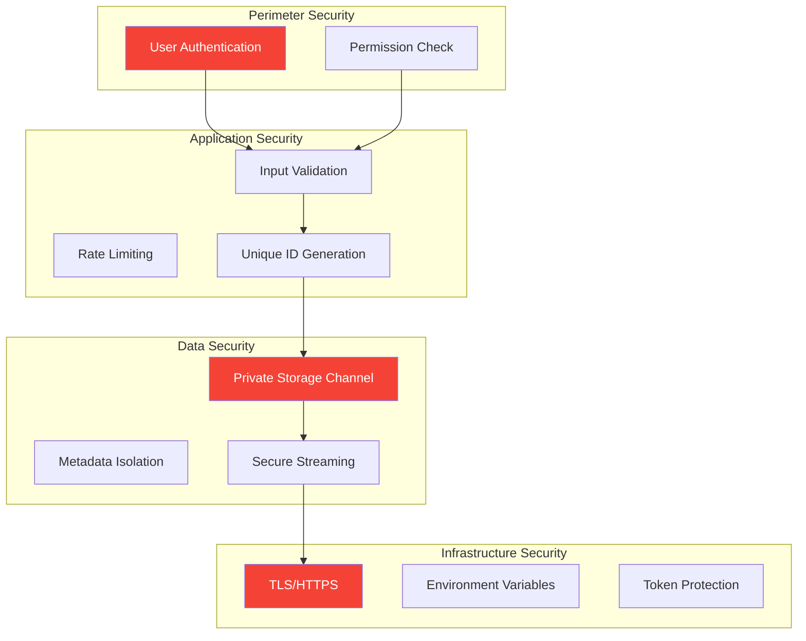

### Access Control Matrix

| Actor | Upload | Download | Manage Channel | Config Access |
|-------|--------|----------|----------------|---------------|
| Authorized User | ✅ | ✅ | ❌ | ❌ |
| Anonymous | ❌ | ✅ (with link) | ❌ | ❌ |
| Bot | ✅ | ✅ | ✅ | ✅ |
| Admin | ✅ | ✅ | ✅ | ✅ |

### Threat Mitigation

| Threat | Mitigation | Status |
|--------|------------|--------|
| Unauthorized Upload | Permission system via chat_config.json | ✅ Implemented |
| Link Guessing | 8-char random IDs (62^8 combinations) | ✅ Implemented |
| Token Exposure | Environment variables only | ✅ Implemented |
| Data Loss | Telegram's redundancy + JSON backup | ✅ Recommended |
| DDoS | Queue system + Rate limiting | ⚠️ Partial |

---

## Technology Stack

### Core Technologies

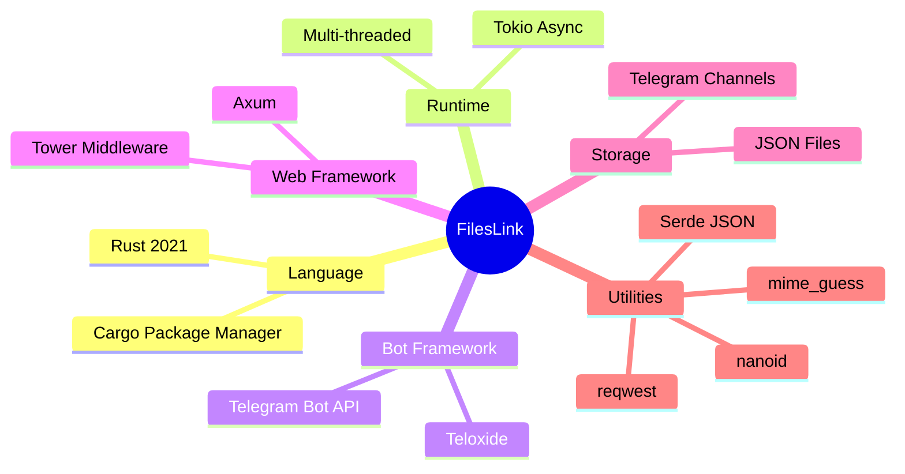

### Dependency Graph

| Crate | Version | Purpose |
|-------|---------|---------|
| `tokio` | 1.38.0 | Async runtime |
| `teloxide` | Latest | Telegram bot API |
| `axum` | 0.7.5 | HTTP server |
| `serde` | 1.0 | Serialization |
| `serde_json` | 1.0 | JSON handling |
| `nanoid` | 0.4 | ID generation |
| `mime_guess` | 2.0 | MIME detection |
| `reqwest` | Latest | HTTP client |
| `log` | 0.4 | Logging facade |
| `pretty_env_logger` | 0.5 | Log formatting |

---

## Performance Characteristics

### Throughput Analysis

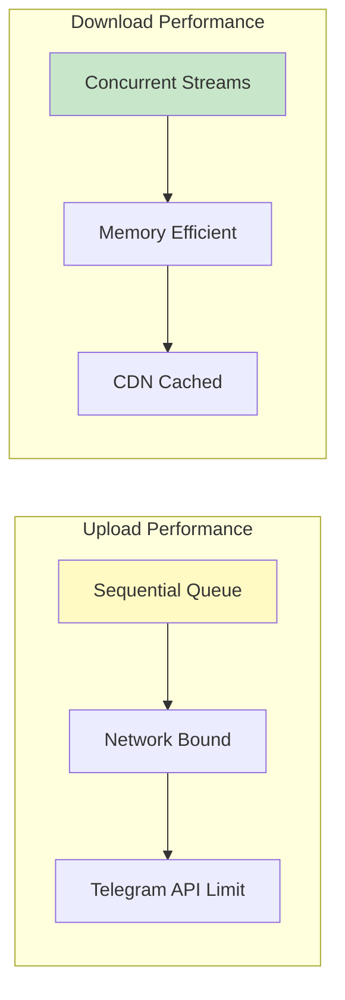

### Performance Metrics

| Operation | Latency | Throughput | Memory | Scalability |
|-----------|---------|------------|--------|-------------|
| **Upload (Small <1MB)** | 1-3s | Sequential | ~10MB | Queue-limited |
| **Upload (Large 100MB)** | 10-30s | Sequential | ~20MB | Queue-limited |
| **Download (Small <1MB)** | 100-500ms | 100+ concurrent | ~5MB per | Horizontal |
| **Download (Large 100MB)** | 2-10s | 50+ concurrent | ~10MB per | Horizontal |
| **Metadata Lookup** | <1ms | 1000+/s | Minimal | Memory-bound |

### Optimization Strategies

1. **Caching Layer**
   - Implement Redis for hot file metadata
   - Cache Telegram file_info responses
   - Reduce JSON file reads

2. **Connection Pooling**
   - Maintain persistent Telegram API connections
   - HTTP/2 for better multiplexing
   - Connection reuse for downloads

3. **Parallel Processing**
   - Multiple queue workers for uploads
   - Async streaming for downloads
   - Background metadata persistence

4. **CDN Integration**
   - Cloudflare/nginx reverse proxy
   - Static asset caching
   - Geographic distribution

---

## Scalability Patterns

### Horizontal Scaling

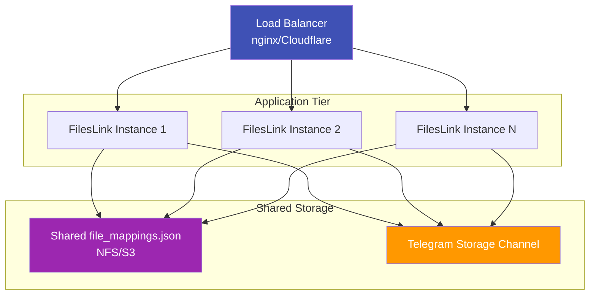

### Bottleneck Analysis

| Component | Bottleneck | Solution |
|-----------|------------|----------|
| Queue Processing | Sequential | Multiple workers |
| Telegram API | Rate limits | Request queuing + backoff |
| Metadata Storage | File I/O | Redis/Database |
| Download Bandwidth | Server uplink | CDN + caching |

---

## Deployment Architecture

### Production Setup

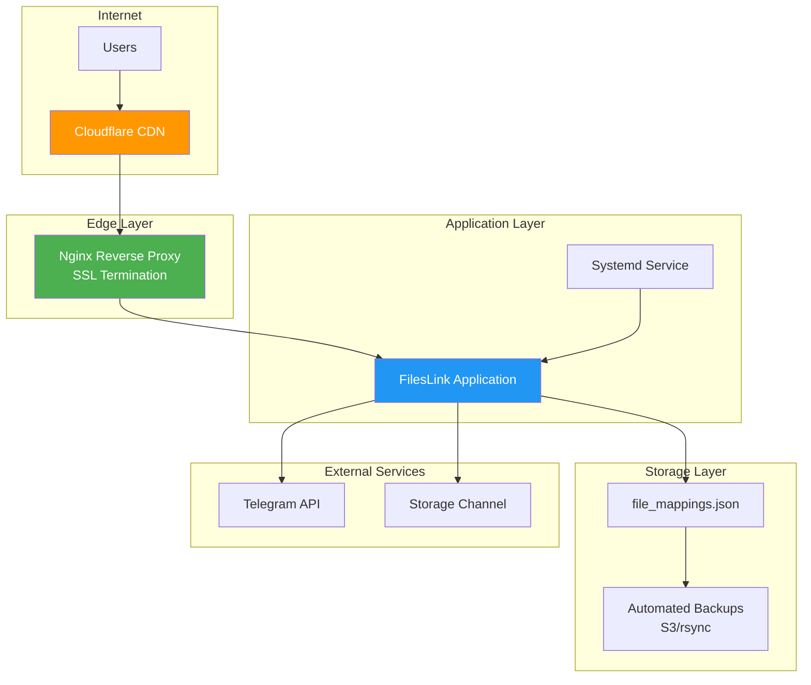

---

## Monitoring and Observability

### Key Metrics

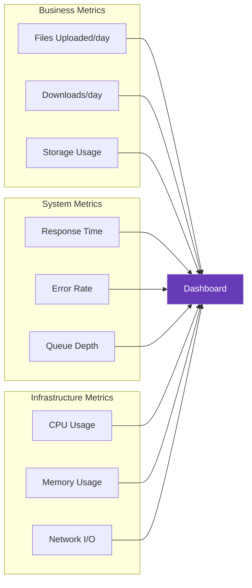

### Health Checks

- Bot connectivity to Telegram
- Storage channel accessibility
- HTTP server responsiveness  
- file_mappings.json read/write
- Disk space availability
- Queue processing status

---

## Disaster Recovery

### Backup Strategy

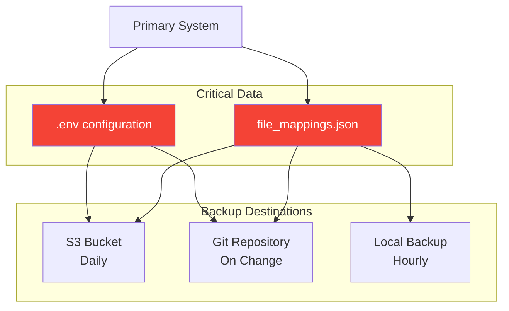

### Recovery Procedures

| Scenario | Impact | Recovery Time | Steps |
|----------|--------|---------------|-------|
| file_mappings.json loss | Links broken | 5 min | Restore from backup |
| Storage channel deleted | All files lost | N/A | Recreate, start fresh |
| Bot token compromised | Security risk | 10 min | Revoke, update, restart |
| Server crash | Service down | 2 min | Auto-restart (systemd) |
| Database corruption | Partial data loss | 30 min | Restore, validate integrity |

---

## Future Enhancements


### Planned Features

- [ ] **Caching System**: Redis for hot files
- [ ] **Admin Dashboard**: Web UI for management
- [ ] **File Expiration**: Auto-delete after N days
- [ ] **Compression**: Compress before upload
- [ ] **Encryption**: E2E encryption option
- [ ] **Multiple Channels**: Load balancing across channels
- [ ] **Statistics**: Download tracking and analytics
- [ ] **Rate Limiting**: Per-user upload/download limits
- [ ] **Search**: Full-text file search
- [ ] **Tags**: File categorization system

---

## Contributing

See [CONTRIBUTING.md](CONTRIBUTING.md) for development guidelines and architecture decisions.

## License

This project architecture is documented under the same license as the project.

---

**Document Version**: 2.0  
**Last Updated**: October 2025  
**Author**: FilesLink Development Team
